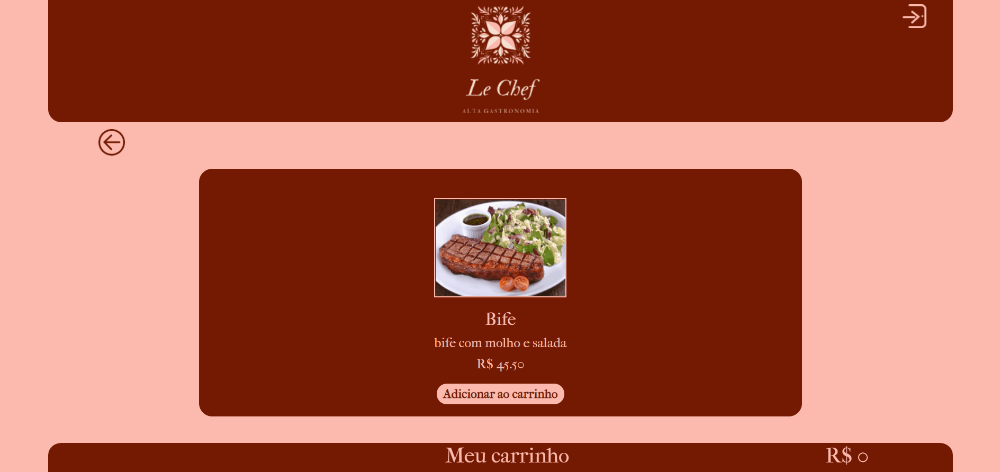
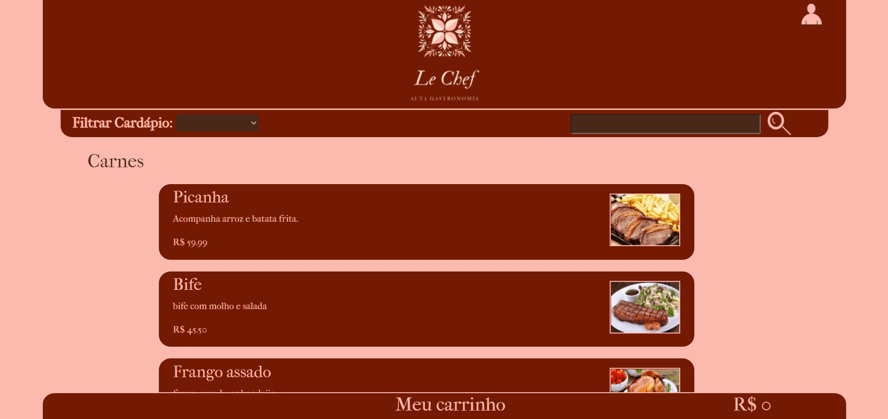
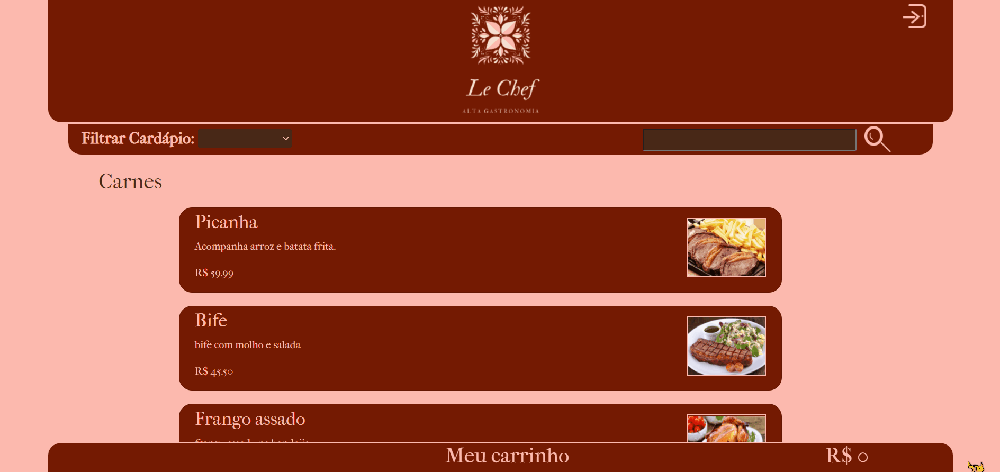
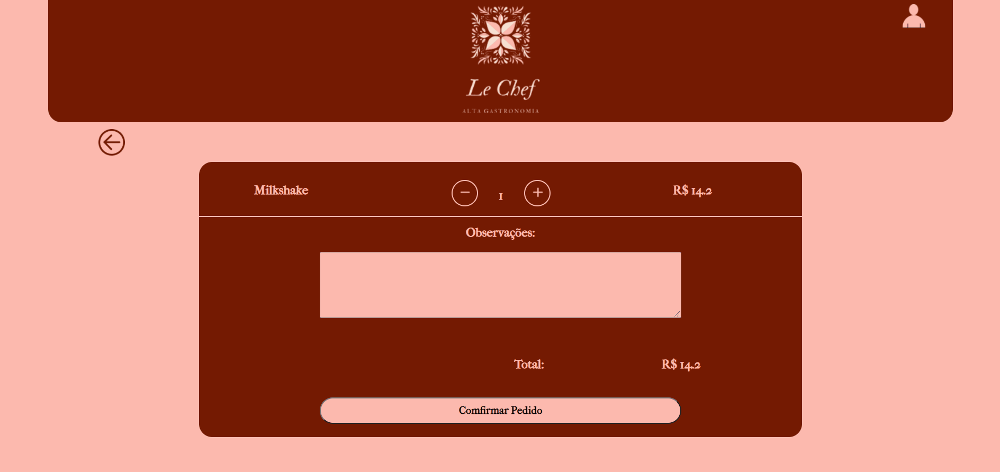
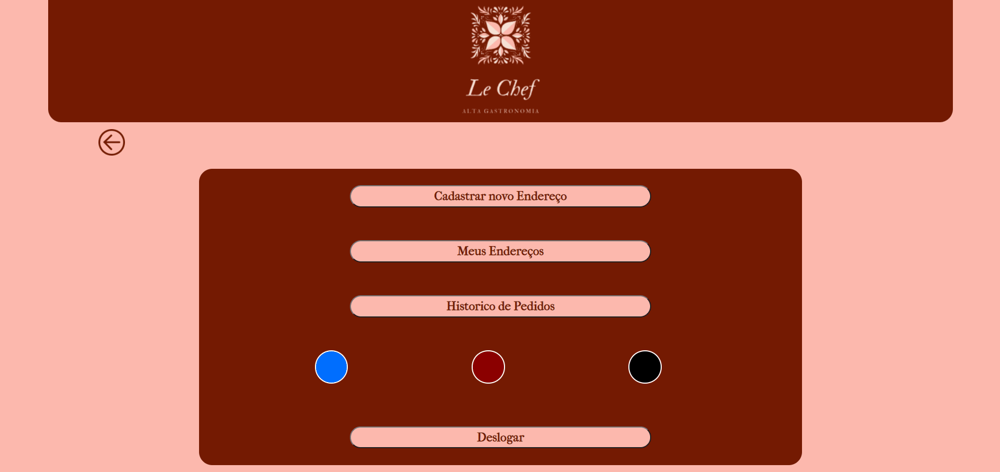

<h1 align="center">Restaurante Lechef</h1>

Esse é um projeto de finalização de curso, onde mostro minhas habilidades em programação WEB

 <a href="#caracteristicas">Características</a> •
 <a href="#pré-requisitos">Pré Requisitos</a> •
 <a href="#tecnologias">Tecnologias</a> •
 <a href="#autor">Autor</a> •
 <a href="#designer">Designer</a>

---

 

### Características
<h1 align="center">
  <h1>Sistema de carrinho</h1>
  

  
  

  <h1>Sistema de Adaptação</h1>
  

  
  

  <h1>Sistema Login</h1>
  

  
  

  <h1>Sistema de Pagamento</h1>
  

  
  

  <h1>Sistema de Temas</h1>
  

  
  

  <h1>Sistema de histórico de Pedidos</h1>
  

  
  

  <h1>Sistema de Gerenciamento</h1>
  

  
  

</h1>
   

### Pré-requisitos

Antes de começar, você vai precisar ter instalado em sua máquina as seguintes ferramentas:
[Git](https://git-scm.com), [XAMPP](https://www.apachefriends.org/pt_br/index.html).

Você também vai precisar configurar o ambiente phpmyadmin.

Além disto é bom ter um editor para trabalhar com o código como [VSCode](https://code.visualstudio.com/)

### Tecnologias

As seguintes ferramentas foram usadas na construção do projeto:

- [Bootstrap 5](https://getbootstrap.com/)
- [MySQL](https://www.mysql.com/)
- [PHP](https://www.php.net/)
- [JavaScript](https://www.javascript.com/)
- [JQuery](https://jquery.com/)

---

### Observação

Antes de entrar na hospedagem para testar o resultado final do projeto, caso o carrinho fique bugado, eu fiz com jquery, mas não estava com muito tempo, para fazer em todas as resoluções de telas, logo, pode aparecer algumas pequenas diferenças.

### Hospedagem em:

https://restaurantelechef.000webhostapp.com/

### Autor

### Designer

